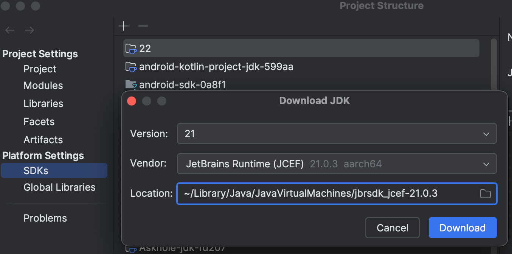
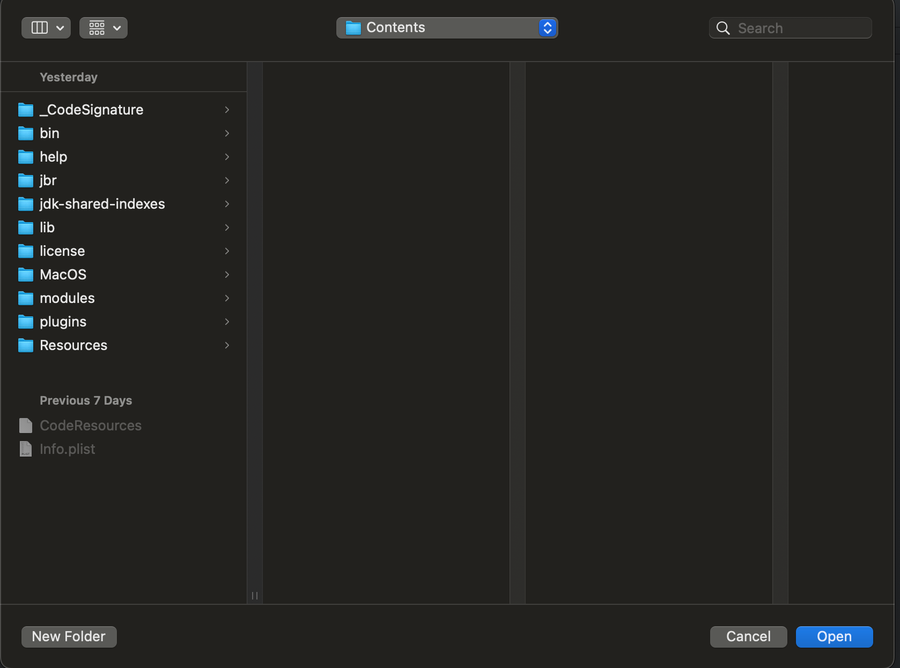
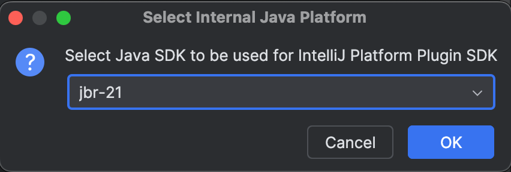
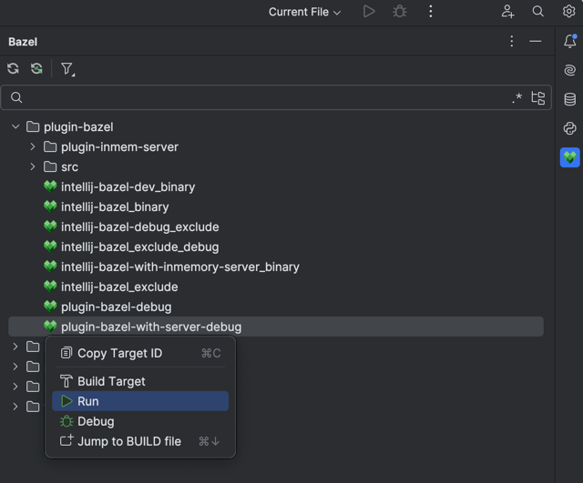

### Requirements

1) `Idea 24.2 Nightly`  
(If doesn't work in Nightly, try `IDEA 24.2 Beta`)
2) Latest plugins installed as explained on [landing page](https://lp.jetbrains.com/new-bazel-plugin/#:~:text=Install%20plugin)  
Debug/developer run configurations are currently tied to our latest plugins, so you have to install both plugins
3) [Plugin DevKit plugin](https://plugins.jetbrains.com/plugin/22851-plugin-devkit) installed.

### How to develop/debug plugins

1) `git clone git@github.com:JetBrains/hirschgarten.git`
2) Open the cloned `hirschgarten` repo in IDEA and wait for it to import.
3) Open "File->Project Structure". Click "SDKs".
4) Hit the "+" button. Click "Download JDK". Install JetBrains Runtime (JCEF) version 21.  
   Some people report JetBrains Runtime version 21 missing in their IDEA. Install JetBrains Runtime 17 than, it will work too.  
     
5) Hit the "+" button. Click "Add IntelliJ Platform Plugin SDK from disk". A "Contents" folder will pop up, hit "Open" in Finder.  
     
6) A "Select Internal Java Platform" dialog will open. Select `jbr-21` (or `jbr-17`) in the dropdown list and click "OK". Then click "OK" again.  
     
7) In the target view, expand the `plugin-bazel` subtree.  
   Right-click "plugin-bazel-with-server-debug" and click "Run".  
   You can use the created run configuration for the current session, but you'll have to right-click the target again next time you open the project.  
   Keep in mind, that running the target from terminal won't work - the target itself is not executable and is tied to run configuration generated by plugin.  
     
