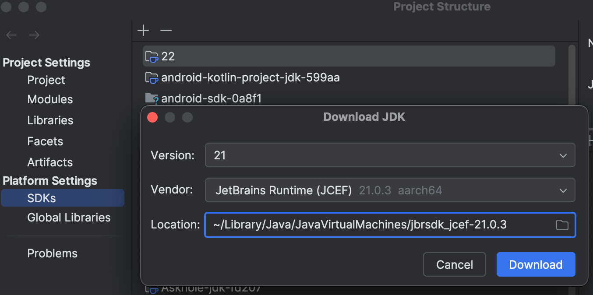
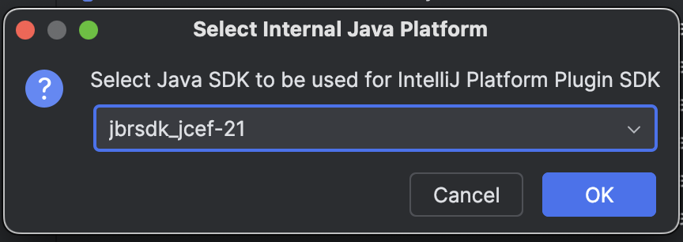
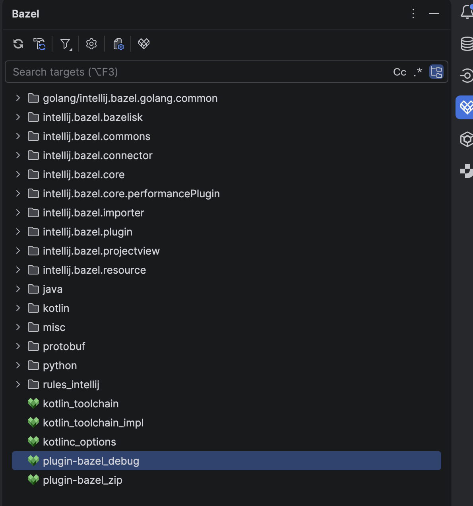

# Plugin Development Setup Guide

This guide provides instructions for setting up and developing our Bazel plugin for JetBrains IDEA.  
Follow these steps to get your development environment ready.

### Requirements

1) IntelliJ IDEA 2025.3 or later Release, Release Candidate or EAP version.
2) Install the [Bazel plugin](https://plugins.jetbrains.com/plugin/22977-bazel-eap-/).
3) [Plugin DevKit](https://plugins.jetbrains.com/plugin/22851-plugin-devkit/versions/stable)

### How to develop/debug plugins

1) `git clone git@github.com:JetBrains/hirschgarten.git`
2) Open the cloned `hirschgarten` repo in IDEA and wait for it to import.
   Ignore errors like `@@bazel_tools//tools/cpp:cc_configure.bzl" does not export a module extension called cc_configure_extension`
3) Open "File->Project Structure". This opens the Project Structure dialog.  
   Click "SDKs".
4) Hit the "+" button.  
   Click "Download JDK".  
   Install JetBrains Runtime (JCEF) version 21.  
   
5) Hit the "+" button.  
   Click "Add IntelliJ Platform Plugin SDK from disk".  
   A file exporer with the 'Contents' folder will open.  
   Click "Open" in this window.  
   
6) A "Select Internal Java Platform" dialog will open.  
   Select `jbrsdk_jcef-21` in the dropdown list and click "OK".  
   Then click "OK" again.  
   
7) In the target view, find `plugin-bazel-debug`, right-click and click `Run` in the context menu.
   
8) The following plugin runs can be started by clicking "Run" button in the upper right corner, next to the now present run configuration.
9) If you want to build a deployable plugin, run `bazel build //:plugin-bazel_zip` and then grab the built plugin at
   `out/bazel-bin/plugin-bazel.zip`.
10) To avoid IDEA showing red code for `BuildEventStreamProtos` class, click Help->Edit Custom Properties... and add the following line:
    `idea.max.intellisense.filesize=10000`
### Conclusion

After completing these steps, your development environment should be ready for plugin development. If you encounter any issues not covered here, please reach out to the team.