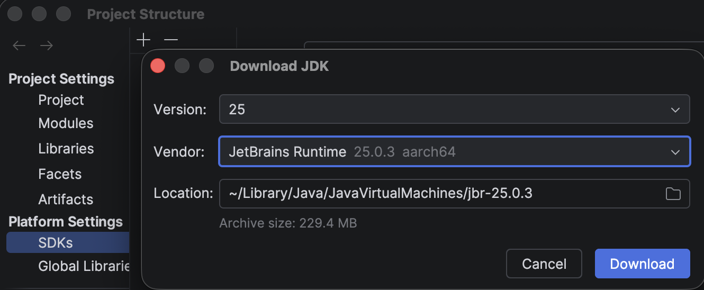
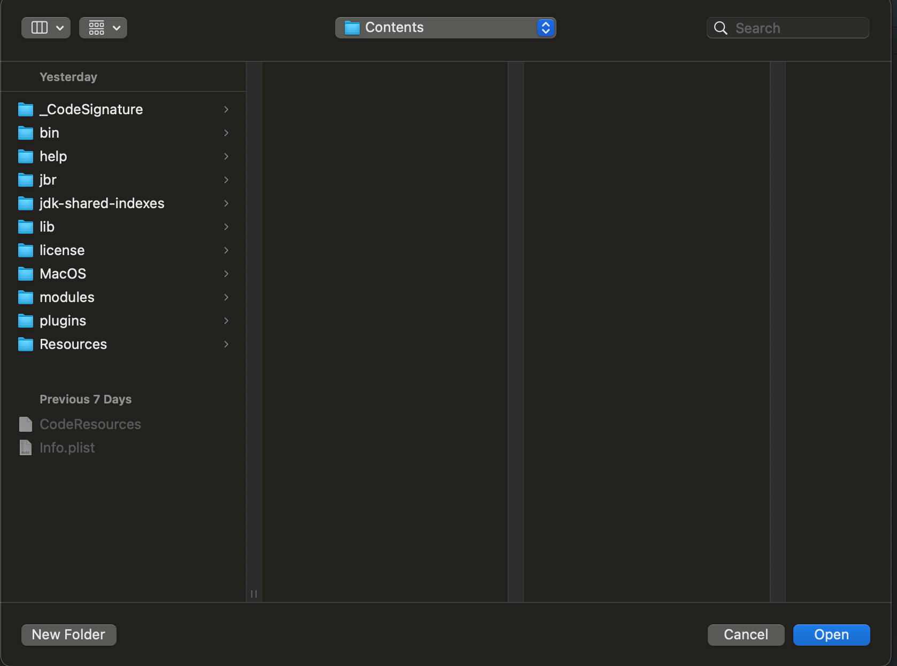
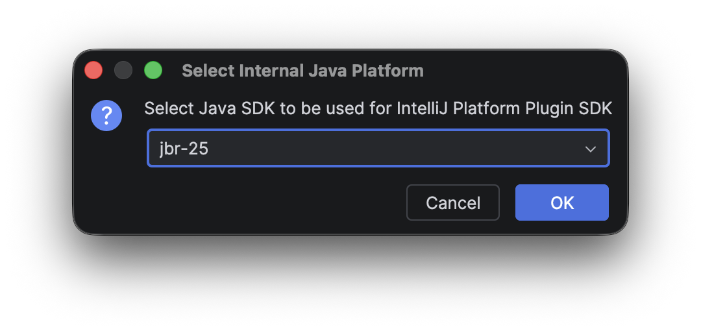
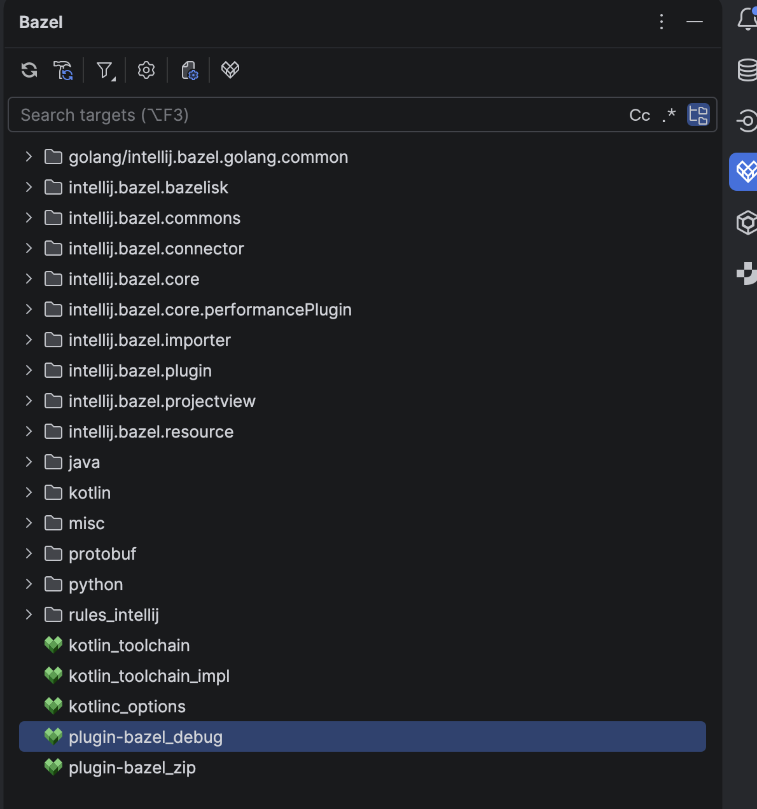

# Plugin Development Setup Guide

This guide provides instructions for setting up and developing our Bazel plugin for JetBrains IDEA.  
Follow these steps to get your development environment ready.

### Limitations

Tests (unit, integration) cannot be compiled and run from their source.
The reason is that it's too difficult to adapt it from our internal build configuration.
This unfortunately means you'll have to submit your PR without tests.

### Build the Bazel plugin from sources
1) `git clone https://github.com/JetBrains/hirschgarten.git`
2) Checkout the 262 branch
3) Run `bazel build //:plugin-bazel_zip` and then grab the built plugin at `out/bazel-bin/plugin-bazel.zip`.

### Develop/debug the Bazel plugin
1) Install IntelliJ IDEA 2026.2 or later version.
2) Install the [Bazel plugin](https://plugins.jetbrains.com/plugin/22977-bazel).
3) Install the [Plugin DevKit](https://plugins.jetbrains.com/plugin/22851-plugin-devkit/versions/stable) plugin.
4) Open the cloned `hirschgarten/MODULE.bazel` file in IDEA. Click "Open as Project" and wait for it to import.
5) Open "File→Project Structure". This opens the Project Structure dialog.  
   Click "SDKs".
6) Hit the "+" button.
   Click "Download JDK".  
   Install JetBrains Runtime version 25.

   
7) Hit the "+" button.  
   Click "Add IntelliJ Platform Plugin SDK from disk".  
   A file exporer with the 'Contents' folder will open.  
   Click "Open" in this window.  
   
8) A "Select Internal Java Platform" dialog will open.  
   Select `jbr-25` in the dropdown list and click "OK".  
   Then click "OK" again.  

   
9) In the target view (open it via the Bazel icon on the right), find `plugin-bazel_debug`, right-click it and click `Run` in the context
   menu.

   
10) The following plugin runs can be started by clicking "Run" button in the upper right corner, next to the now present run configuration.
11) To avoid IDEA showing red code for `BuildEventStreamProtos` class, click Help->Edit Custom Properties... and add the following line:
    `idea.max.intellisense.filesize=10000`
### Conclusion

After completing these steps, your development environment should be ready for plugin development. If you encounter any issues not covered here, please reach out to the team.