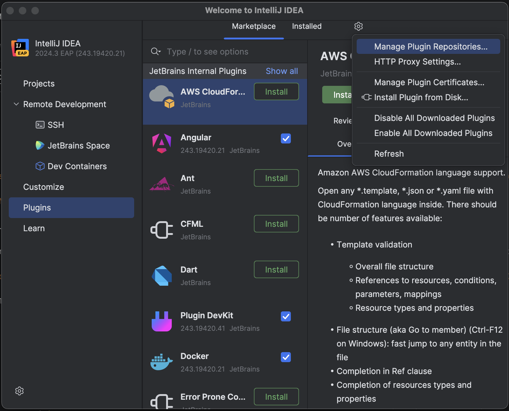
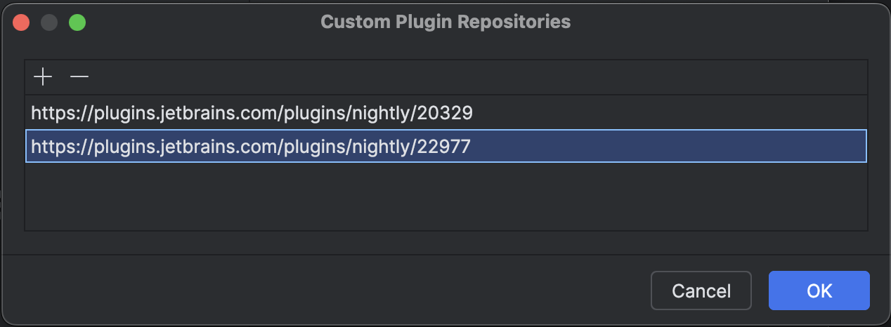
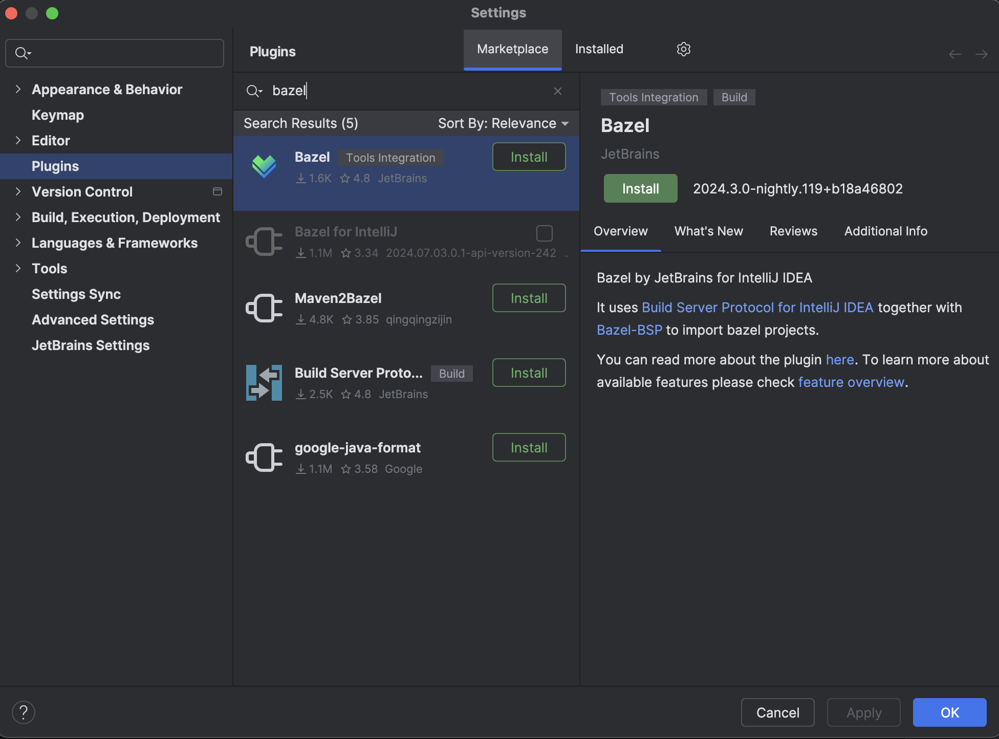

# New Bazel plugin + Android

1. Install IntelliJ IDEA 2024.3 EAP.
2. Open IDEA, click on "Plugins", click the settings icon on the top right, click "Manage Plugin Repositories..."
   
3. Hit the "+" button, add `https://plugins.jetbrains.com/plugins/nightly/20329`.
4. Hit the "+" button, add `https://plugins.jetbrains.com/plugins/nightly/22977`.
   
5. Search "Bazel" in the Marketplace and install the nightly version of the plugin.
   
6. Also install the [Android plugin](https://plugins.jetbrains.com/plugin/22989-android), [Android Design Tools plugin](https://plugins.jetbrains.com/plugin/22990-android-design-tools), [Jetpack Compose plugin](https://plugins.jetbrains.com/plugin/18409-jetpack-compose).

7. Install the Android SDK and set the [ANDROID_HOME](https://developer.android.com/tools/variables) environment variable.

8. Open any random project inside IntelliJ IDEA (e.g. a “Hello world” app, doesn’t matter).

9. Double-press Shift to bring up the search menu, enter “Registry” and click on it. Then find the `bsp.android.support` registry flag and enable it:

   

10. Create the following `projectview.bazelproject` file in the root of your Bazel Android project:
   ```
   targets:
     //...

   enabled_rules:
     rules_android
     rules_kotlin
   ```
   If you don't use Kotlin, then omit `rules_kotlin`.
   If you don't use the starlarkified `rules_android`, then add `native_rules_android` to the `enabled_rules` section instead.
   
   If you use `build_bazel_rules_android` instead of `rules_android` or `io_bazel_rules_kotlin` instead of `rules_kotlin`, 
   then use that instead, e.g."
   ```
   enabled_rules:
     build_bazel_rules_android
     io_bazel_rules_kotlin
   ```

   If you are using an old version of `rules_android`, you may need to add the following to `.bazelrc`:
   ```
   build --experimental_google_legacy_api
   build --experimental_enable_android_migration_apis
   ```
   in order to prevent errors like `AndroidManifestInfo is experimental and thus unavailable with the current flags`.
7. Bazel 5 and 6 are not supported for now. Make sure they are not overridden in `.bazelversion`.

8. Then open the project in IntelliJ IDEA and wait for it to import!

9. Press “Build & Resync” afterwards to make sure all the dependent libraries are unzipped by Bazel.
