# Bazel Query Support

Feature flag: `bazel.query.tab.enabled`

## Overview:
- syntax and error highlighting
- completion for functions, operators and targets defined in a project
- quick documentation for functions and flags
- quick query flags selection

## Layout:
To open the query editor, use the Bazel Query button in the main toolbar of the Bazel plugin toolwindow.

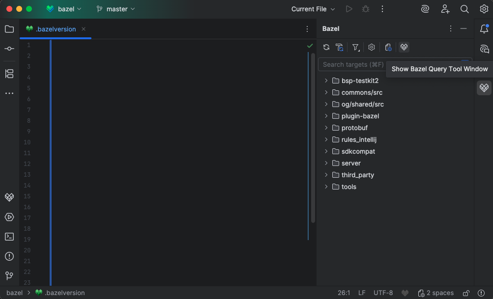

Bazel Query toolwindow appears at the bottom of the IntelliJ IDEA window.

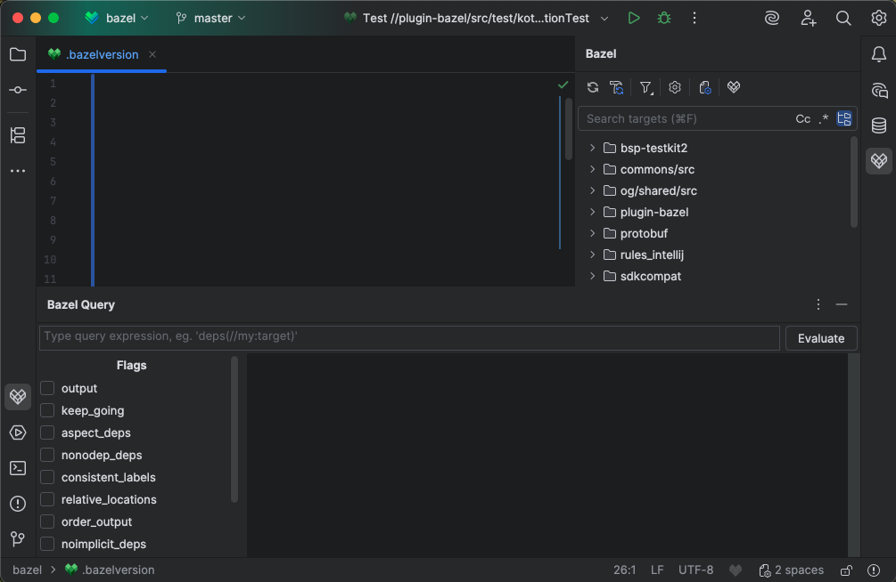

## Features:

### Query text field

Syntax highlighting 

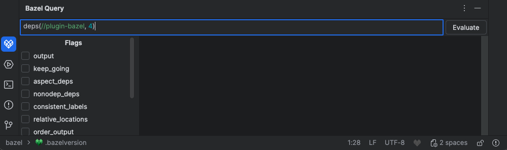

Error checking

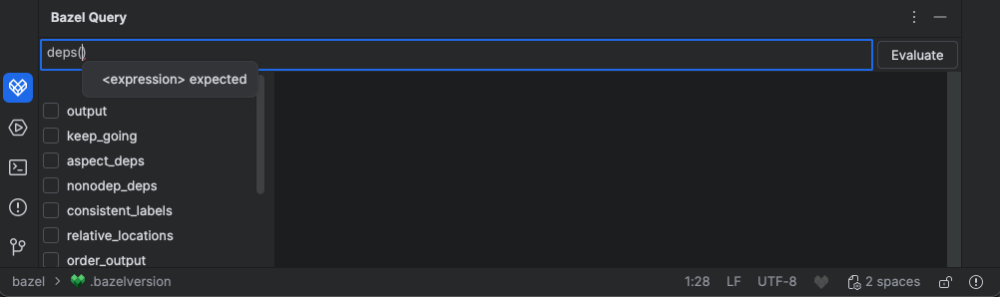

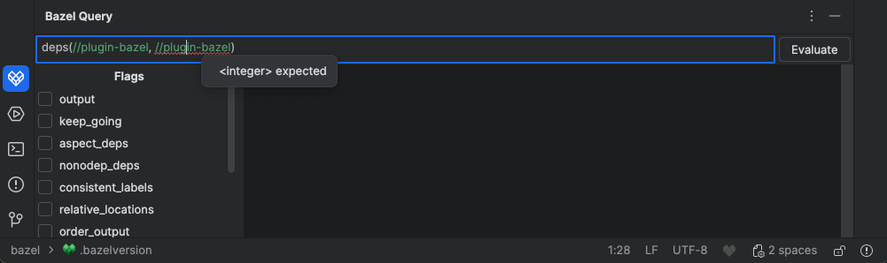

Completion for functions, operators and targets defined in a project

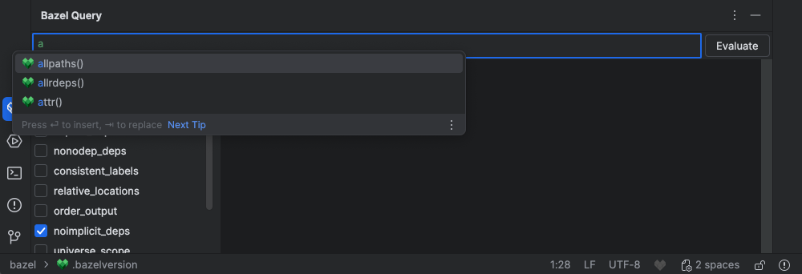

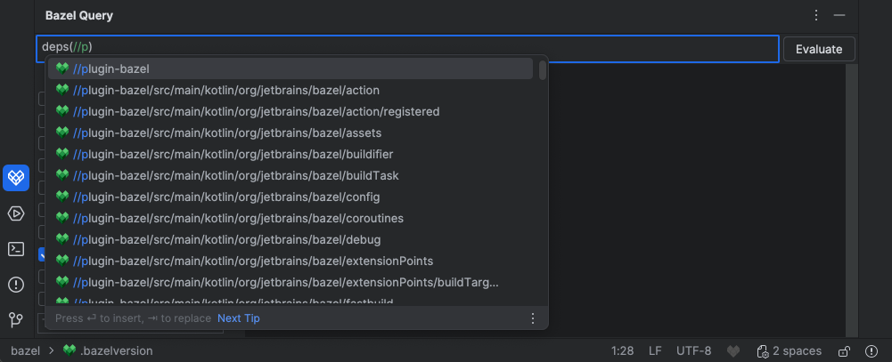

Quick documentation for functions

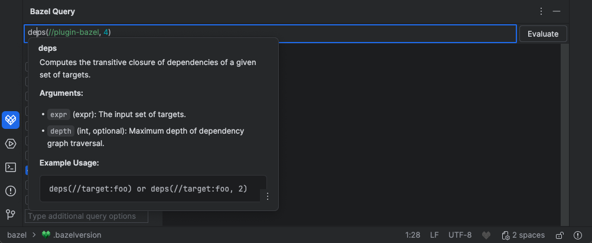

### Flags panel
Selecting query flags from the list

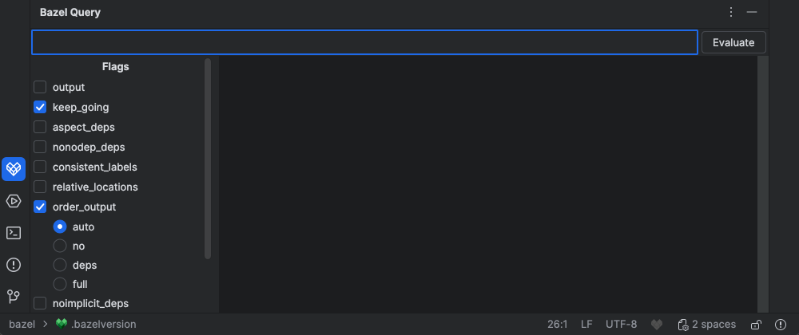

Quick documentation for query flags in the list

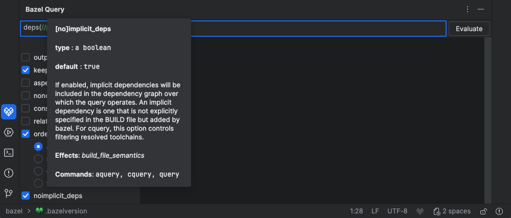

Text field for additional query flags, also with syntax highlighting, error checking and quick documentation

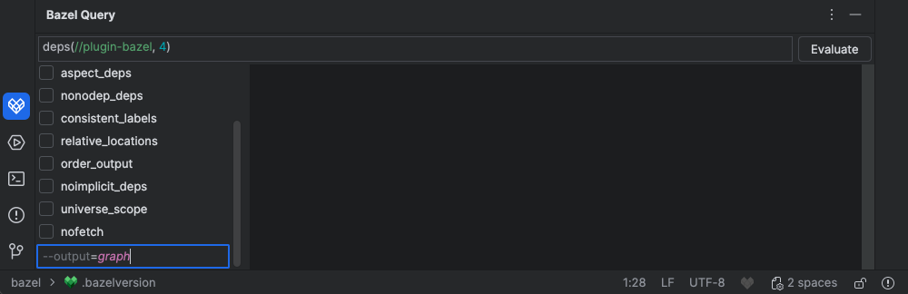

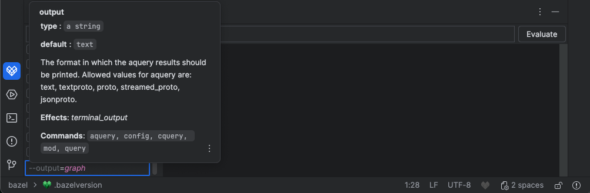

### Output panel
Result of the query execution with links to source files or build files where the given target is located.

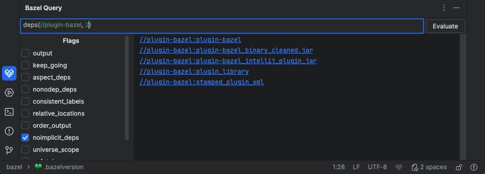

If `output` flag is set to `graph`, graph visualisation is generated with Graphviz (`dot` command) and displayed in default tool for .svg files.

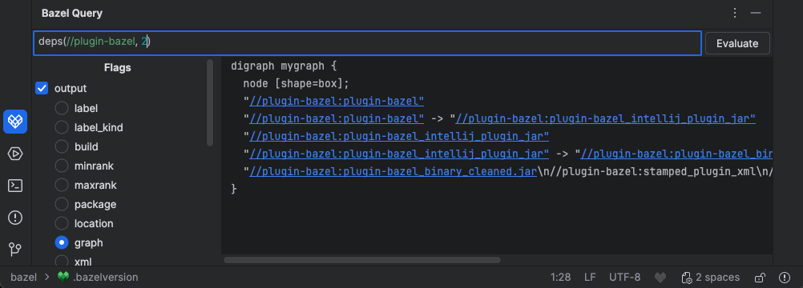

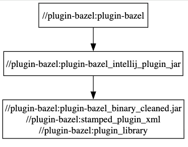

### Keyboard navigation
Keyboard navigation is supported in the query text field and flags panel.
Enter key executes the query.
Completion suggestions are selected with:
  - Enter - insets current suggestion,
  - Tab - inserts a fragment of the target suggestion to the slash occurrence (corresponding to next subpackage on the path), for example, for the entered prefix "//p", selecting the suggestion "//path/to/my:target" using 'tab' will result in "//path/".