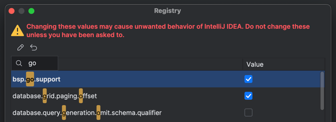

# New Bazel plugin + Go

1. Install the new Bazel plugin by following instructions for the [landing page](https://lp.jetbrains.com/new-bazel-plugin/). 
2. Also install the [Go plugin](https://plugins.jetbrains.com/plugin/9568-go) (available only for IntelliJ IDEA Ultimate)
3. Open any random project inside IntelliJ IDEA (e.g. a “Hello world” app, doesn’t matter). 
4. Double-press Shift to bring up the search menu, enter “Registry” and click on it. Then find the `bsp.go.support` registry flag and enable it:
   )
5. Then open the project in IntelliJ IDEA and wait for it to import!
6. Press “Build & Resync” afterwards to make sure all the dependent libraries are unzipped by Bazel.
7. Expected behaviour:
   - typing `GOROOT` in the settings window should show automatically set GOROOT,
   - Go support should be marked as enabled in all the modules,
   - the only imports that should work are the ones from the standard Go library (for now!),
   - run line markers should work.

```
```
