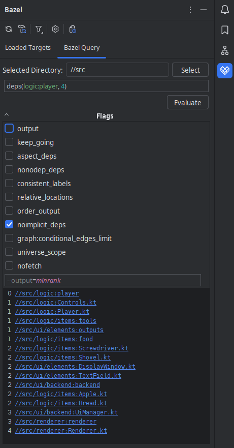
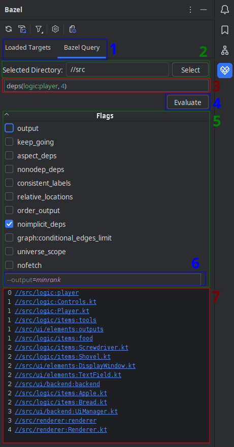
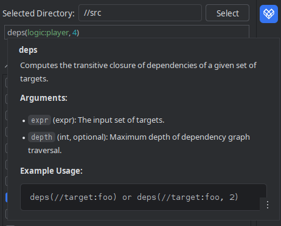
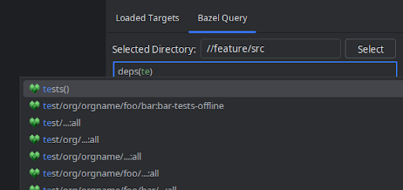

# Quick overview of Bazel Query tab

(The feature is currently hidden until it is fully tested)

## Features:
- writing and running Bazel Query queries without the need to use the terminal
  - syntax and error highlighting
  - completion for functions, operators and targets defined in a project
  - quick documentation for functions and flags
- working directory selection
- quick query flags selection

## Layout:

1. Selector between Targets and Query
2. Directory selection panel
3. Query input field
4. Button to start query evaluation or cancel it while executing
5. Flag input field (flags with multiple options display them only when that flag is selected)
6. Additional flags field
7. Output field with clickable targets

Example of quick documentation for function 'deps'.

Example of autocompletion for the prefix "te" (with suggested functions and targets).

## Behavior:
While writing queries, functions and target completions are suggested and errors are highlighted.

Hovering over the function shows quick documentation.

When a query succeeds/fails, the result panels display contents of the standard output/error stream respectively.

When an `output` flag is set do display `graph`, graph visualisation is generated with Graphviz (`dot` command).

When succeeded, the output field contains clickable links to source files or build files where the given target is located.
