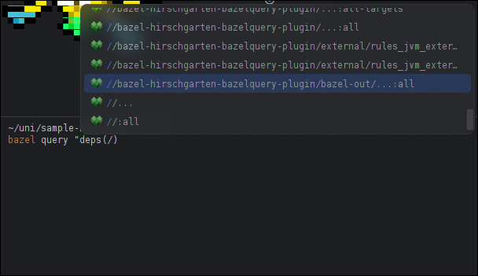

# Enabling Bazel Query autocompletion in New Terminal 2024

How to enable?

1. Make sure `bazel.query.terminal.completion` option is enabled (it's off by default)
   1. Open the search menu, either by double-pressing Shift or using Navigate > Search Everywhere.
   2. Search for `Registry` and open it.
   3. Locate the flag by the `bazel.query.terminal.completion` key and enable it.
2. Restart IDE
3. Use the Experimental 2024 Terminal
   1. Click three dots on the right-top corner of the terminal
   2. Select `Terminal Engine` -> `Experimental 2024`
      
4. Enjoy!

