# Fixing compilation errors of the Bazel plugin after monorepo refactorings

## Intro

The Bazel plugin currently compiles against four IDEA versions:
- IDEA master (built with JPS)
- 2024.3 (built with Bazel)
- 2025.1 (built with Bazel)
- 2025.2 (built with Bazel)

The reason is that some big customers are still on old IDEA versions and we still want to deliver bugfixes and features to them.

If you rename a function or break an interface that the Bazel plugin depends on,
you're going to have to fix it for all three builds, otherwise the Bazel plugin build will fail (and so will your safe push).

## How does the Bazel plugin build for four IDEA versions?

Any function or class that differs between IDEA versions is not used from the Bazel plugin source code directly.
Instead, we add a compatibility layer. It should have the same signatures (such that the calling code is the same),
but three different implementations. Those three implementations are put into three different subdirectories of
`ultimate/plugins/bazel/sdkcompat`.
During compilation for different IDEA targets, the dependency is switched: 
- JPS build against IDEA master compiles `sdkcompat/master`
- Bazel build against 2025.2 compiles `sdkcompat/v252`
- Bazel build against 2025.1 compiles `sdkcompat/v251`
- Bazel build against 2024.3 compiles `sdkcompat/v243`

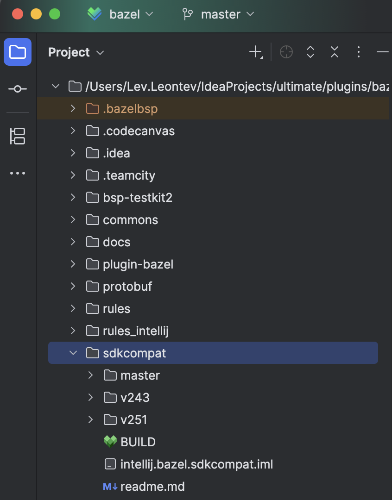

**Note:** AI Assistant also publishes for different IDEA versions, but they still build from IDEA master (which they can afford because the used API surface is not very large).
Bazel plugin uses a lot of IDEA internals, so, e.g., the plugin built against IDEA master will crash on 2025.1.

## Example

### Making a breaking refactoring

Let's say we dislike the naming of `AsyncDirectoryProjectConfigurator.configure`:

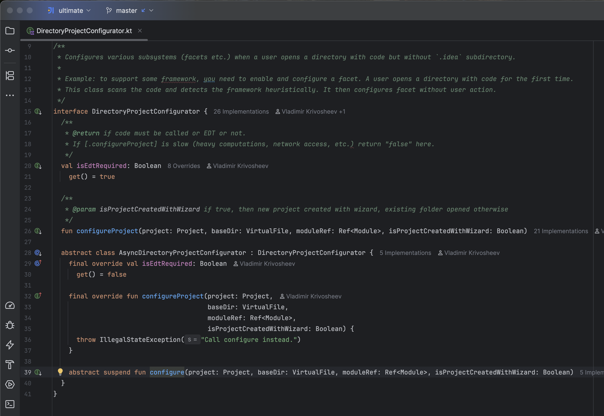

You rename it to a much better name, `configureRenamed`, and then safe-push:

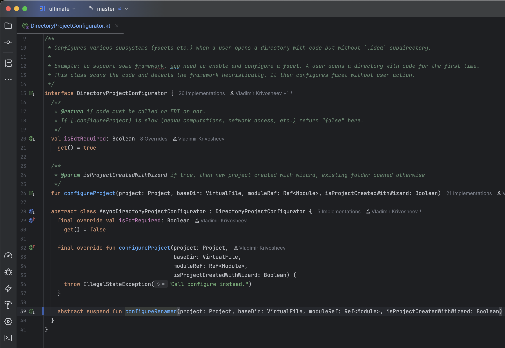

### Safe-push fails

Upon safe-push you get an error like this:
```
ERROR: /Users/teamcity/IdeaProjects/ultimate/plugins/bazel/plugin-bazel/src/main/kotlin/org/jetbrains/bazel/flow/BUILD:3:15: KotlinCompile //plugin-bazel/src/main/kotlin/org/jetbrains/bazel/flow:flow { kt: 5, java: 0, srcjars: 0 } for darwin_arm64 failed: (Exit 1): build failed: error executing KotlinCompile command (from target //plugin-bazel/src/main/kotlin/org/jetbrains/bazel/flow:flow) bazel-out/darwin_arm64-opt-exec-ST-d57f47055a04/bin/external/rules_kotlin+/src/main/kotlin/build ... (remaining 2 arguments skipped)
plugin-bazel/src/main/kotlin/org/jetbrains/bazel/flow/exclude/BazelSymlinkExcludeDirectoryProjectConfigurator.kt:20:10: error: class 'BazelSymlinkExcludeDirectoryProjectConfigurator' is not abstract and does not implement abstract base class member 'configure'.
internal class BazelSymlinkExcludeDirectoryProjectConfigurator : DirectoryProjectConfigurator.AsyncDirectoryProjectConfigurator() {
         ^^^^^^^^^^^^^^^^^^^^^^^^^^^^^^^^^^^^^^^^^^^^^^^^^^^^^
plugin-bazel/src/main/kotlin/org/jetbrains/bazel/flow/exclude/BazelSymlinkExcludeDirectoryProjectConfigurator.kt:21:3: error: 'configureRenamed' overrides nothing.
  override suspend fun configureRenamed(
  ^^^^^^^^
```

The reason? IDEA's "rename" refactoring changed the Bazel plugin code to use the new shiny `configureRenamed` method.
But when compiling the Bazel plugin source code against IDEA 2025.2, this will cause the error above.
That's because on IDEA 2025.2 the method is still named `configure`.

### Importing the Bazel plugin source as a Bazel project

In order to fix the error, you'll have to import the Bazel plugin subdirectory as a Bazel project.
This is because we use Bazel to compile the Bazel plugin against 2025.2, 2025.1 and 2024.3.

First install the Bazel plugin from Marketplace and restart IDEA:

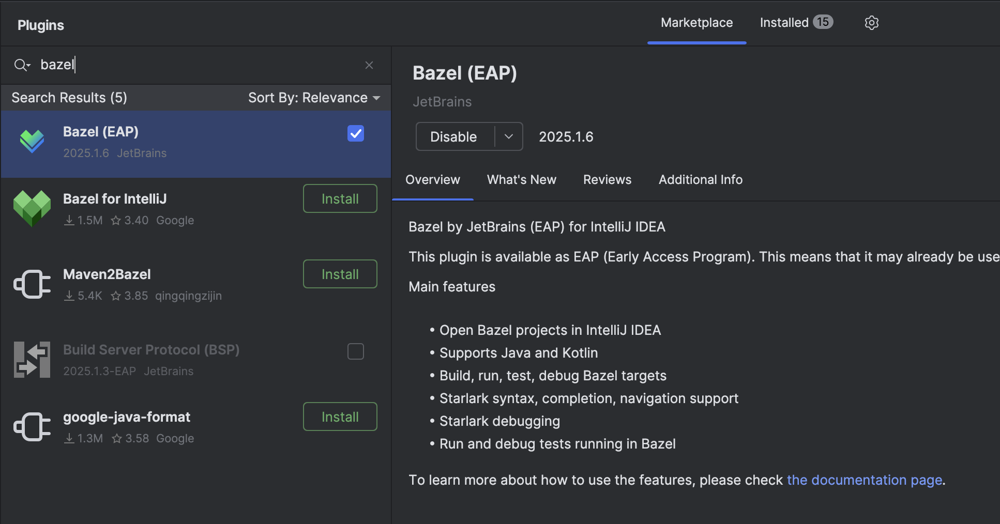

Then click on "File -> Open..." and choose `ultimate/plugins/bazel/MODULE.bazel`:

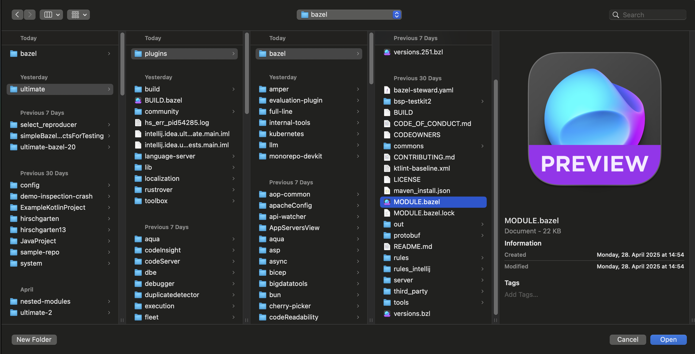

Click "Open as Project" as this dialog appears:

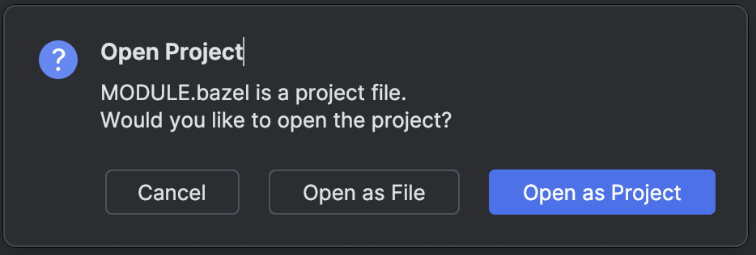

Then wait for the project to import (which will take a while).

### Adding dependency on sdkcompat for Bazel build

Open the file that failed the build earlier. You should now see the same error in the IDE that we previously got in the safe-push:

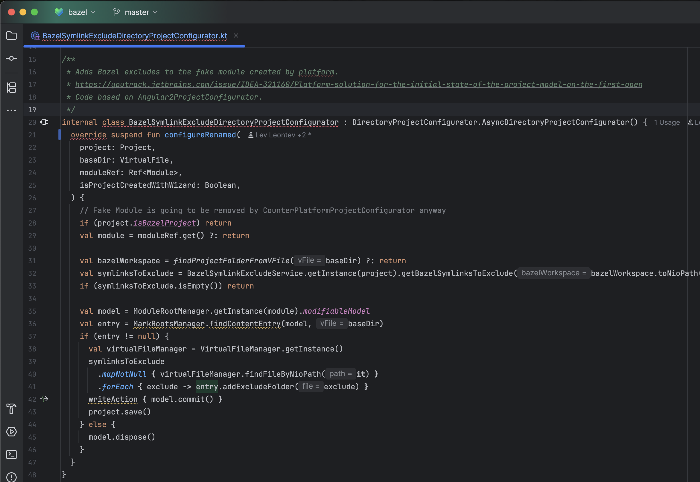

Right-click the code of the file (i.e., the opened editor) and click on "Jump to BUILD file" in the context menu:

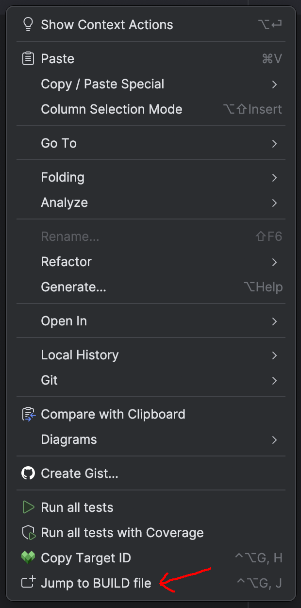

Then add a new line to the `deps` array: `"//sdkcompat",` (if it is not added yet; otherwise, do nothing)

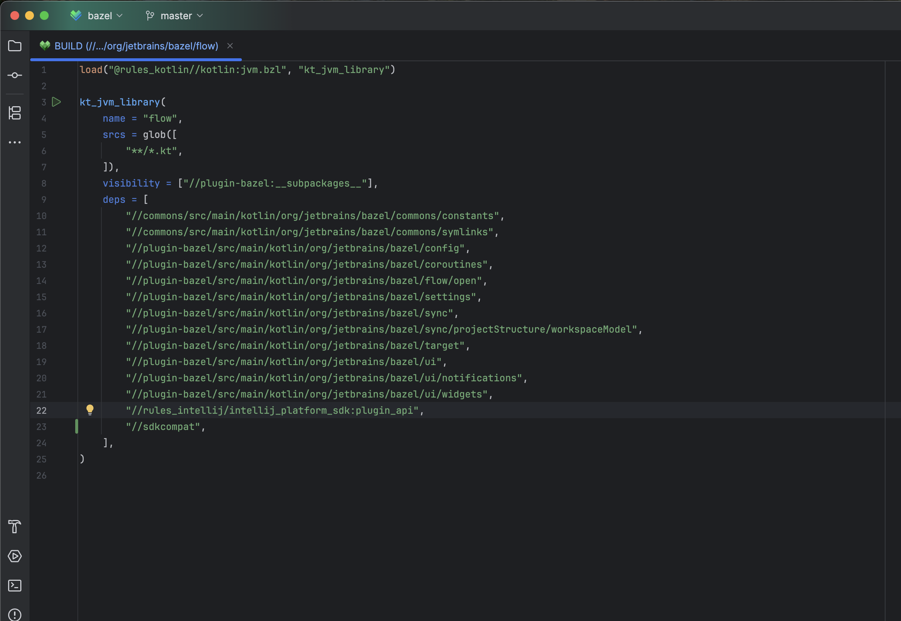

Then resync the project so that IDEA knows about this change we've just done:

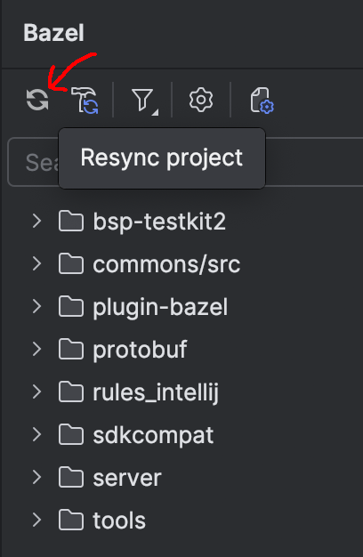

### `v243`, `v251`, `v252` folders of sdkcompat

Because `sdkcompat/v252`, `sdkcompat/v251`, and `sdkcompat/v243` are only used when building `ultimate/plugins/bazel` with Bazel, we're going to use the imported subfolder (`ultimate/plugins/bazel`)
in this section.

We know that the `configure` method was renamed to `configureRenamed` in IDEA master. Therefore, the Bazel plugin code
can't depend on the `AsyncDirectoryProjectConfigurator` class anymore. We have to create a compatibility layer.
Let's name it `AsyncDirectoryProjectConfiguratorCompat`. It should have the same method signatures in all IDEA versions. 

Create a new `AsyncDirectoryProjectConfiguratorCompat.kt` in `sdkcompat/v252`.
Because the default target for Bazel build is 2025.2, this is the currently imported subdirectory of `sdkcompat`.

Here we'll add a `configureCompat` method that the Bazel plugin code will override. Because in 2025.1 the method
used to be called `configure`, we'll call `configureCompat` from there.

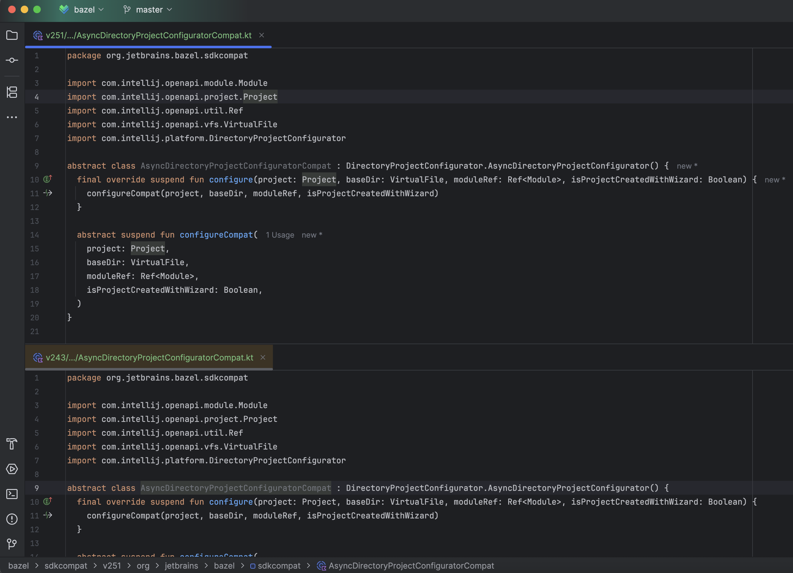

Copy the same file to `sdkcompat/v251` and `sdkcompat/v243`, because the implementation is going to be the same for other IDEA versions.
(If not, then you can change `build --define=ij_product=intellij-2025.1` to `build --define=ij_product=intellij-2024.3`
inside `ultimate/plugins/bazel/.bazelrc` and then re-import the project to develop for the other IDEA target.)

Then open the problematic file and change the superclass from `AsyncDirectoryProjectConfigurator` to `AsyncDirectoryProjectConfiguratorCompat`.
Now we also override `configureCompat` instead of `configureRenamed`.

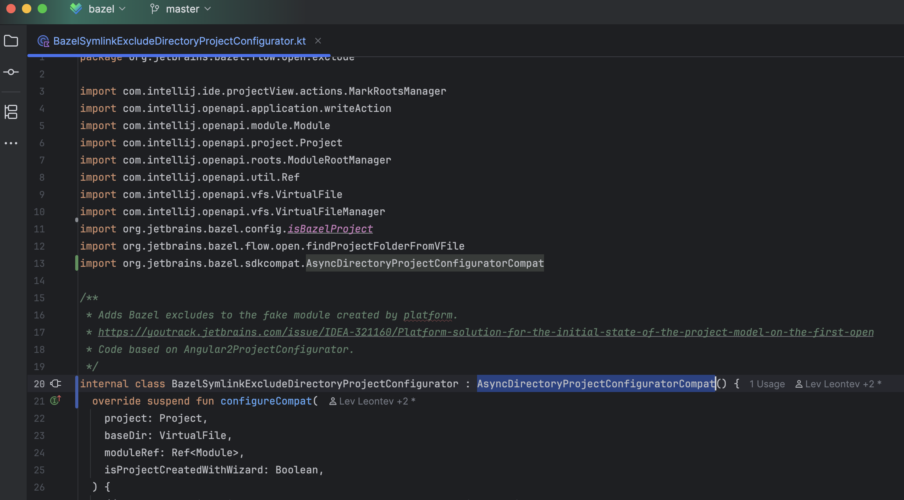

To check that the Bazel build is now fixed, click "Build Project" under "Build" and see if there's any compilation errors left.

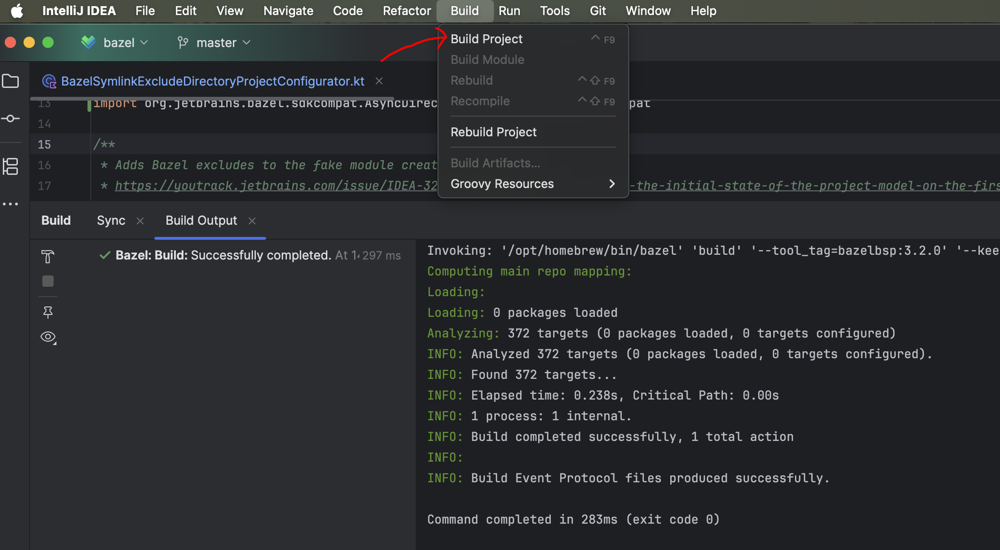

### `master` folder of sdkcompat

`sdkcompat/master` is only used when building `ultimate` with JPS, so we're going to use the `ultimate` monorepo in this section.

After having changed the superclass from `AsyncDirectoryProjectConfigurator` to the newly-added `AsyncDirectoryProjectConfiguratorCompat`
we now have a broken JPS build, because `sdkcompat/master` doesn't have `AsyncDirectoryProjectConfiguratorCompat` yet! Let's implement it:

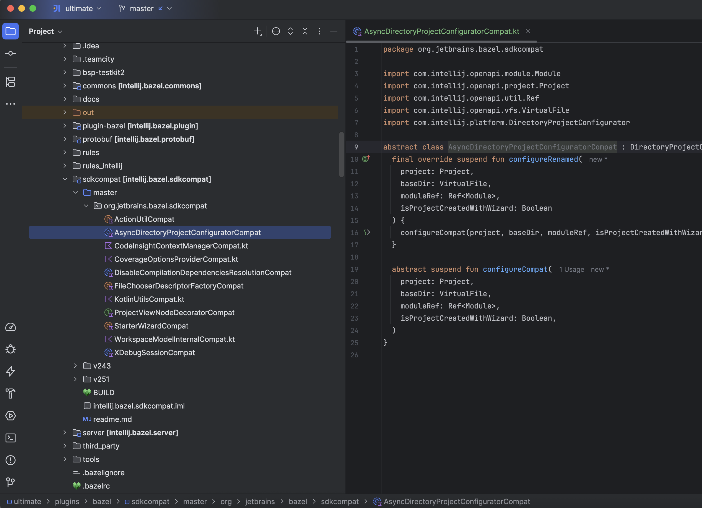

We add the same `configureCompat` method as in `v252`, `v251`, and `v243`, so that the Bazel plugin code compiles without errors for any IDEA target. 
Then we implement the new-and-shiny `configureRenamed` method by calling `configureCompat` from it.

**The Bazel plugin code stays the same because the class and method signatures are the same for all sdkcompat directories!**


If you've done everything correctly, the problematic class should have no red code whether opening `ultimate` as a JPS project,
or importing the `ultimate/plugins/bazel` subdirectory as a Bazel project 🎉
