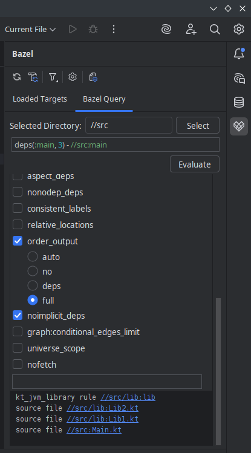
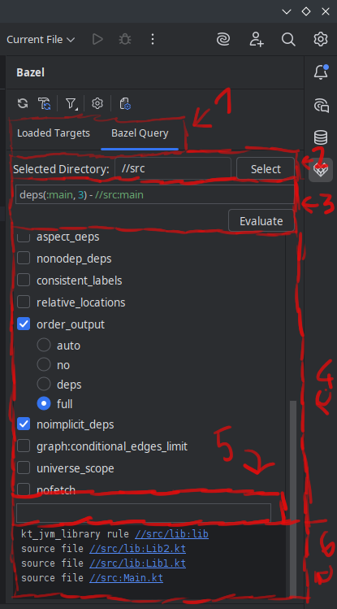
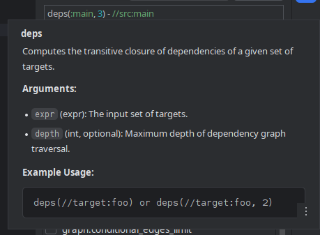
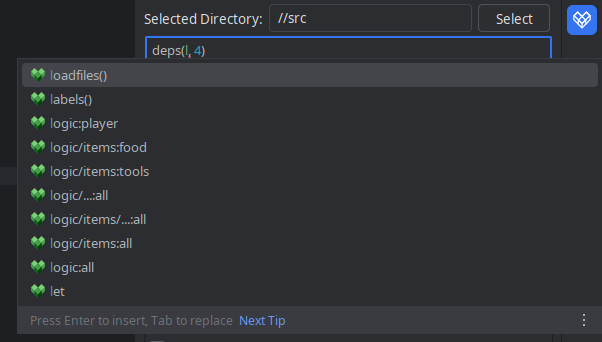

# Quick overview of Bazel Query tab

(Feature currently has to be enabled through experimental settings)

## Features:
- writing and running Bazel Query queries without the need to use the terminal
- running directory selection
- quick query flag selection

## Layout:

1. Selector between Targets and Query
2. Directory selection panel
3. Query input field
4. Flag input field (flags with multiple options display them only when that flag is selected)
5. Additional flags field
6. Output field with clickable outputs

Example of quick documentation.

Example of auto completion (with suggested functions and targets).

## Behavior:
While writing queries, functions and target completions are suggested, while errors are highlighted.

Hovering over the function shows quick documentation.

When a query succeeds/fails, in the result panels are displayed contents of the standard output/error stream respectively.

When an `output` flag is set do display `graph`, graph visualisation is generated with Graphviz (`dot` command).

When succeeded output field contains clickable links to source files or build files where given target is located.
