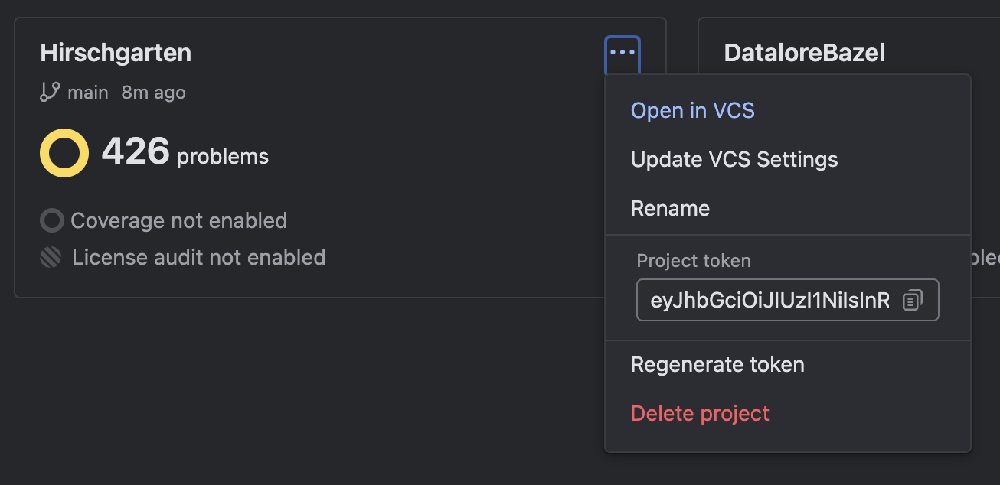

# Run Qodana locally

## Make sure all commands and files are run from the folder tools/qodana in the terminal

## Prerequisites

1) Docker Desktop installed (macOS)  
Alternatively you can use Orbstack (`brew install orbstack`), which works better on macOS
2) At least 32GB RAM  
You should allow docker container to use at least 28GB of memory in Docker Desktop settings
3) Bazel Team permissions to access `Hirschgarten` project on qodana.cloud

## Running Qodana

### Connect to our docker registry
1) Go to https://jetbrains.team/p/bazel/packages/container/docker-private
2) Click "Connect" in the top right corner and follow the instructions  
After you connect go to the next step of this instruction, don't try to pull an image

### Build plugin and create pre-requisite folders

Run `./prepare_qodana.sh`  
Re-run the script if you made changes to code and want to check Qodana's result for updated plugin

### Provide $QODANA_TOKEN value

1) Go to https://qodana.cloud/teams/3rwQe
2) Click on three dot button on `Hirschgarten`  
  
3) Copy token from "Project token" field  
If you don't see this field — reach out to project admin
4) Run `export QODANA_TOKEN=<token value>`

### Run qodana

1) Run `./run_qodana.sh` to get only local results  
They will be displayed at http://localhost:8080/ after run finishes and before you ctrl+c the container
2) Run `./run_qodana.sh online` to send results to qodana.cloud  
Results will be displayed at https://qodana.cloud/projects/3Xj1D (don't forget to choose your branch to see a relevant report)

## Troubleshooting

1) **Docker error 137**  
This error indicates that the Docker run out of memory. Make sure to give Docker access to at least 28GB RAM in Docker Desktop (or Orbstack) settings  
If your machine has less than 32GB RAM, sometimes it helps to re-run Qodana, but it still might fail
